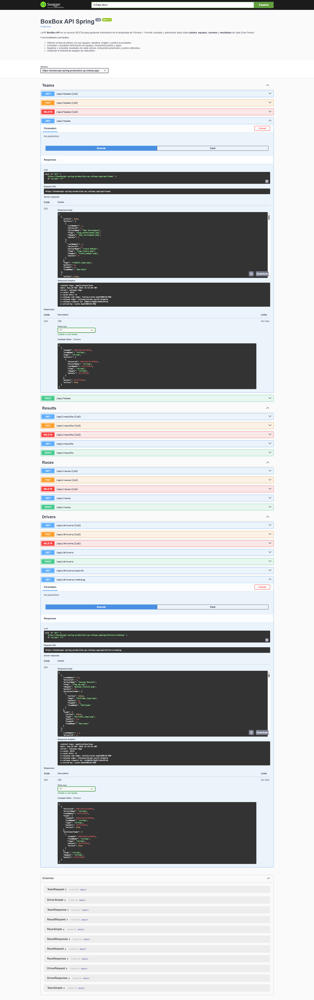

# BoxBoxApi-Spring


API REST para la gestión de datos de Fórmula 1: pilotos, equipos, carreras y resultados.  
Desarrollada con **Spring Boot**, usando **H2** en memoria para pruebas y PostgreSQL en producción.

---

## 🔹 Características

- CRUD de **Pilotos (Drivers)**
- CRUD de **Equipos (Teams)**
- CRUD de **Carreras (Races)**
- CRUD de **Resultados (Results)**
- Documentación de API con **OpenAPI / Swagger**
- Manejo global de excepciones con `@RestControllerAdvice`
- Test unitarios con **JUnit 5** y **Mockito**

---

## 🚀 Tecnologías

- Java 21
- Spring Boot 4.x
- Spring Data JPA
- Spring Web MVC
- H2 Database (testing)
- PostgreSQL (producción)
- Lombok
- SpringDoc OpenAPI

---

## ⚙️ Instalación

1. Clona el repositorio:

```bash
git clone https://github.com/RafaelLibrero/BoxBoxApi-Spring.git
cd boxbox
```

2. Construye el proyecto con Maven:

```bash
mvn clean install
```

3. Ejecuta la aplicación: 

```bash
mvn spring-boot:run
```

4. Accede en la API en: 

```bash
http://localhost:8080/
```

## Endpoints de la API

### Drivers
| Verbo | URL | Descripcion |
|-------|-----|-------------|
| GET | `/api/drivers` | Listar todos los pilotos |
| GET | `/api/drivers/{id}` | Consultar piloto por ID |
| POST | `/api/drivers` | Crear un nuevo piloto |
| PUT | `/api/drivers/{id}` | Actualizar piloto existente |
| DELETE | `/api/drivers/{id}` | Eliminar piloto |
| GET | `/api/drivers/search` | Buscar pilotos por nombre |
| GET | `/api/drivers/ranking` | Listar pilotos ordenados por puntos descendentes |

### Teams
| Verbo | URL | Descripcion |
|-------|-----|-------------|
| GET | `/api/teams` | Listar todos los equipos |
| GET | `/api/teams/{id}` | Consultar equipo por ID |
| POST | `/api/teams` | Crear un nuevo equipo |
| PUT | `/api/teams/{id}` | Actualizar equipo existente |
| DELETE | `/api/teams/{id}` | Eliminar equipo |

### Races
| Verbo | URL | Descripcion |
|-------|-----|-------------|
| GET | `/api/races` | Listar todas las carreras |
| GET | `/api/races/{id}` | Consultar carrera por ID |
| POST | `/api/races` | Crear una nueva carrera |
| PUT | `/api/races/{id}` | Actualizar carrera existente |
| DELETE | `/api/races/{id}` | Eliminar carrera |

### Results
| Verbo | URL | Descripcion |
|-------|-----|-------------|
| GET | `/api/results` | Listar todos los resultados |
| GET | `/api/results/{id}` | Consultar resultado por ID |
| POST | `/api/results` | Registrar resultado de una carrera |
| PUT | `/api/results/{id}` | Actualizar resultado existente |
| DELETE | `/api/results/{id}` | Eliminar resultado |

Puedes consultar la documentación Swagger/OpenAPI en:  
[http://localhost:8080/swagger-ui/index.html](http://localhost:8080/swagger-ui/index.html)



## 🧪 Tests

Los tests unitarios usan **JUnit 5** y **Mockito**:

```bash
mvn test
```

## 🌐 Despliegue

La API está desplegada en Railway:

🔗 https://boxboxapi-spring-production.up.railway.app/

Swagger disponible en:
🔗 https://boxboxapi-spring-production.up.railway.app/swagger-ui/index.html